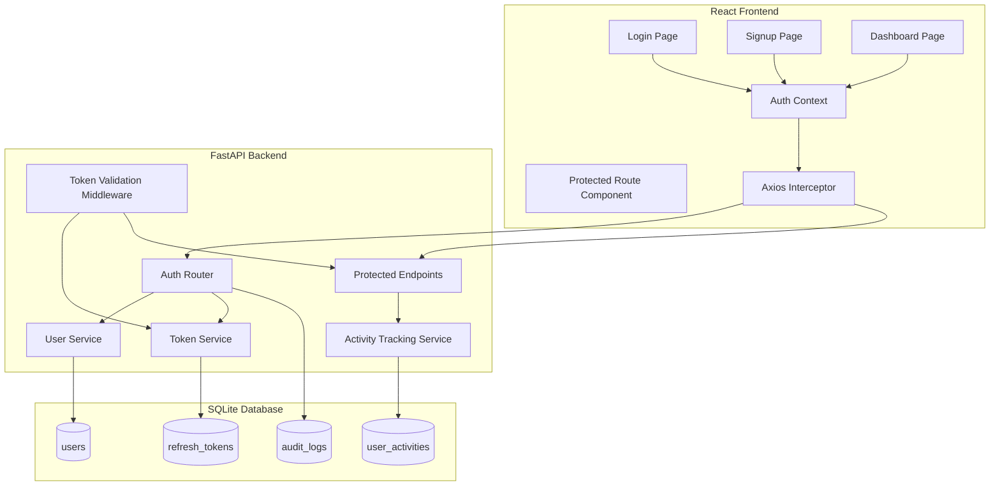
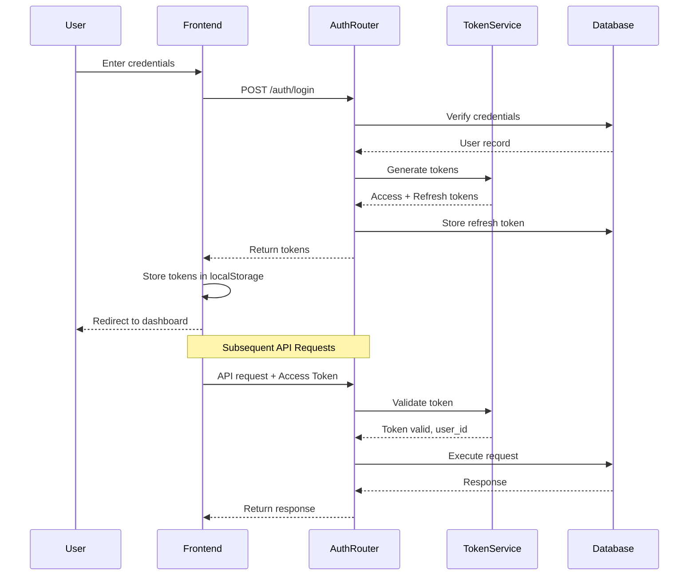
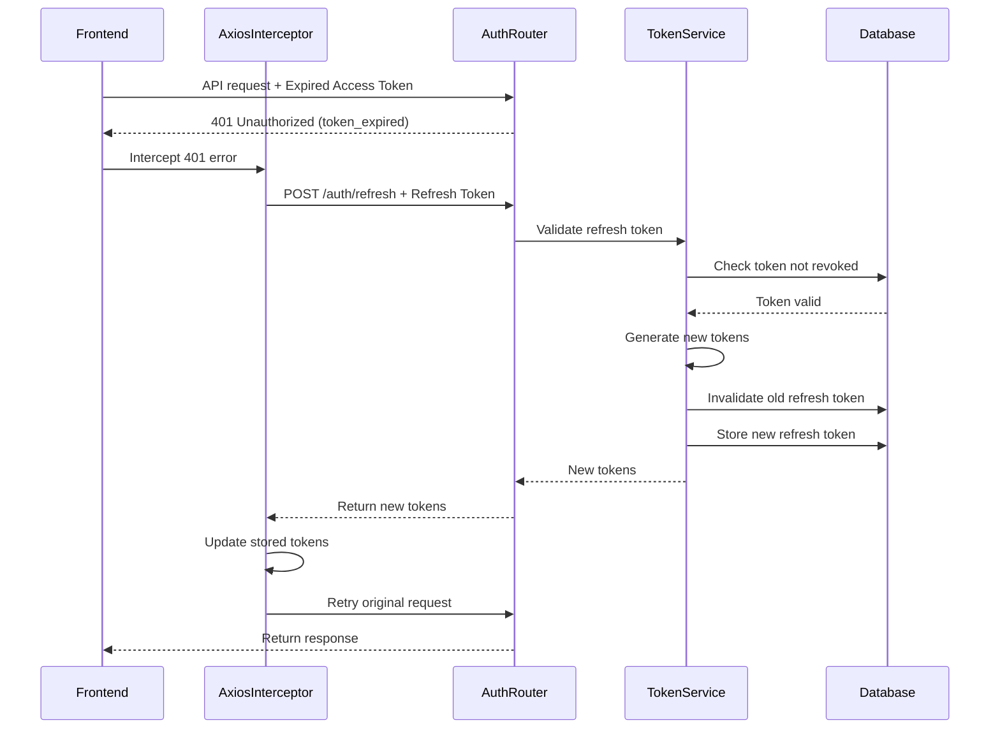

# Design Document: User Authentication and Management System

## Overview

The User Authentication and Management System provides secure, HIPAA-compliant authentication for the Healthcare AI Assistant. The system implements JWT-based authentication with access and refresh tokens, user registration and login, session management, and user-specific activity tracking. It integrates seamlessly with the existing FastAPI backend and React frontend while maintaining backward compatibility through feature flags.

### Key Features

- **JWT-based Authentication**: Short-lived access tokens (30 minutes) and long-lived refresh tokens (7 days)
- **User Registration and Login**: Email/password authentication with bcrypt password hashing
- **Token Refresh Mechanism**: Automatic token renewal without re-authentication
- **Session Management**: Multi-device session support with session revocation
- **User Dashboard**: Personalized dashboard with usage statistics (chat queries, image analyses, vital sign measurements)
- **Activity Tracking**: Automatic tracking of user interactions with protected endpoints
- **Security Features**: Rate limiting, HTTPS enforcement, CORS configuration, HIPAA audit logging
- **Password Reset**: Secure password reset flow with time-limited tokens
- **Protected Routes**: Frontend and backend route protection with authentication middleware
- **Backward Compatibility**: Feature flags to enable/disable authentication requirements

### Design Goals

1. **Security First**: Implement industry-standard security practices (bcrypt, JWT, rate limiting, HTTPS)
2. **HIPAA Compliance**: Comprehensive audit logging, data encryption, session management
3. **Seamless Integration**: Minimal disruption to existing codebase and user experience
4. **Performance**: Fast authentication operations (<1000ms for login, <500ms for token refresh)
5. **User Experience**: Automatic token refresh, persistent sessions, clear error messages
6. **Maintainability**: Clean separation of concerns, well-documented APIs, comprehensive testing

## Architecture

### System Components



### Authentication Flow



### Token Refresh Flow



## Components and Interfaces

### Backend Components

#### 1. Authentication Router (`src/auth/router.py`)

Handles all authentication-related HTTP endpoints.

**Endpoints:**

- `POST /auth/register` - User registration
- `POST /auth/login` - User login
- `POST /auth/refresh` - Token refresh
- `POST /auth/logout` - User logout
- `GET /auth/me` - Get current user profile
- `PUT /auth/me` - Update user profile
- `PUT /auth/me/password` - Change password
- `POST /auth/password-reset/request` - Request password reset
- `POST /auth/password-reset/confirm` - Confirm password reset
- `GET /auth/sessions` - Get active sessions
- `DELETE /auth/sessions/{session_id}` - Revoke specific session
- `DELETE /auth/sessions` - Revoke all other sessions
- `GET /auth/dashboard` - Get user dashboard with enhanced statistics

**Admin Endpoints:**

- `GET /admin/users` - List all users (admin only)
- `GET /admin/users/{user_id}` - Get detailed user information (admin only)
- `GET /admin/users/{user_id}/activities` - Get user activity history (admin only)
- `PUT /admin/users/{user_id}/disable` - Disable user account (admin only)
- `PUT /admin/users/{user_id}/enable` - Enable user account (admin only)
- `DELETE /admin/users/{user_id}` - Soft delete user account (admin only)
- `GET /admin/dashboard` - Get admin dashboard with system-wide statistics (admin only)
- `GET /admin/analytics` - Get detailed analytics and trends (admin only)

**Request/Response Models:**

```python
class RegisterRequest(BaseModel):
    email: EmailStr
    password: str  # Min 8 chars, 1 upper, 1 lower, 1 number, 1 special

class LoginRequest(BaseModel):
    email: EmailStr
    password: str
    remember_me: bool = False

class TokenResponse(BaseModel):
    access_token: str
    refresh_token: str
    token_type: str = "bearer"
    expires_in: int  # seconds

class UserResponse(BaseModel):
    id: int
    email: str
    created_at: datetime
    updated_at: datetime
    last_activity_at: Optional[datetime]
    is_admin: bool = False
    is_active: bool = True

class DashboardResponse(BaseModel):
    user: UserResponse
    statistics: UsageStatistics
    recent_activities: List[ActivitySummary]
    usage_trends: UsageTrends
    health_insights: HealthInsights
    quick_links: List[QuickLink]

class UsageStatistics(BaseModel):
    total_chat_queries: int
    total_images_analyzed: int
    total_vital_measurements: int
    account_age_days: int
    last_login: datetime
    this_week_queries: int
    this_month_queries: int
    most_active_day: str

class ActivitySummary(BaseModel):
    activity_type: str
    timestamp: datetime
    description: str
    metadata: Optional[Dict[str, Any]]

class UsageTrends(BaseModel):
    daily_usage: List[DailyUsage]
    weekly_usage: List[WeeklyUsage]
    monthly_usage: List[MonthlyUsage]

class DailyUsage(BaseModel):
    date: str
    chat_count: int
    imaging_count: int
    vitals_count: int

class HealthInsights(BaseModel):
    total_interactions: int
    most_used_feature: str
    engagement_score: float
    recommendations: List[str]

class QuickLink(BaseModel):
    title: str
    url: str
    icon: str
    description: str

class AdminDashboardResponse(BaseModel):
    total_users: int
    active_users: int
    total_chat_queries: int
    total_images_analyzed: int
    total_vital_measurements: int
    usage_trends: SystemUsageTrends
    top_users: List[TopUser]
    recent_registrations: List[UserResponse]
    system_health: SystemHealth
    auth_failures: AuthFailureStats

class SystemUsageTrends(BaseModel):
    daily_trends: List[DailySystemUsage]
    weekly_trends: List[WeeklySystemUsage]
    monthly_trends: List[MonthlySystemUsage]

class TopUser(BaseModel):
    user_id: int
    email: str
    total_activities: int
    last_activity: datetime

class SystemHealth(BaseModel):
    uptime_percentage: float
    average_response_time: float
    error_rate: float
    active_sessions: int

class AuthFailureStats(BaseModel):
    total_failures: int
    failures_last_24h: int
    top_failure_reasons: List[FailureReason]

class FailureReason(BaseModel):
    reason: str
    count: int

class AdminUserDetailResponse(BaseModel):
    user: UserResponse
    statistics: UsageStatistics
    activities: List[ActivitySummary]
    sessions: List[SessionInfo]
    audit_logs: List[AuditLogEntry]

class SessionInfo(BaseModel):
    id: int
    device_info: str
    ip_address: str
    created_at: datetime
    last_used_at: datetime
    is_active: bool

class AuditLogEntry(BaseModel):
    event_type: str
    timestamp: datetime
    ip_address: str
    user_agent: str
    metadata: Optional[Dict[str, Any]]
```

#### 2. Admin Router (`src/admin/router.py`)

Handles all admin-related HTTP endpoints for user management and system monitoring.

**Interface:**

```python
@router.get("/users", response_model=List[UserResponse])
async def list_users(
    skip: int = 0,
    limit: int = 100,
    search: Optional[str] = None,
    is_active: Optional[bool] = None,
    current_admin: User = Depends(get_current_admin)
):
    """List all users with optional filtering."""
    pass

@router.get("/users/{user_id}", response_model=AdminUserDetailResponse)
async def get_user_details(
    user_id: int,
    current_admin: User = Depends(get_current_admin)
):
    """Get detailed information about a specific user."""
    pass

@router.put("/users/{user_id}/disable")
async def disable_user(
    user_id: int,
    current_admin: User = Depends(get_current_admin)
):
    """Disable a user account and revoke all sessions."""
    pass

@router.get("/dashboard", response_model=AdminDashboardResponse)
async def get_admin_dashboard(
    current_admin: User = Depends(get_current_admin)
):
    """Get admin dashboard with system-wide statistics."""
    pass
```

#### 3. Token Validation Middleware (`src/auth/middleware.py`)

FastAPI dependency that validates JWT tokens on protected endpoints.

**Interface:**

```python
async def get_current_user(
    authorization: str = Header(None),
    settings: Settings = Depends(get_settings)
) -> User:
    """
    Validates JWT access token and returns current user.
    
    Raises:
        HTTPException(401): If token is missing, invalid, or expired
    """
    pass

async def get_current_user_optional(
    authorization: str = Header(None),
    settings: Settings = Depends(get_settings)
) -> Optional[User]:
    """
    Optional authentication - returns user if token valid, None otherwise.
    Used for backward compatibility mode.
    """
    pass

async def get_current_admin(
    current_user: User = Depends(get_current_user)
) -> User:
    """
    Validates that current user has admin role.
    
    Raises:
        HTTPException(403): If user is not an admin
    """
    if not current_user.is_admin:
        raise HTTPException(status_code=403, detail="Admin access required")
    return current_user
```

#### 4. User Service (`src/auth/services/user_service.py`)

Business logic for user management operations.

**Interface:**

```python
class UserService:
    def __init__(self, db: Session):
        self.db = db
    
    async def create_user(self, email: str, password: str) -> User:
        """Create new user with hashed password."""
        pass
    
    async def get_user_by_email(self, email: str) -> Optional[User]:
        """Retrieve user by email address."""
        pass
    
    async def get_user_by_id(self, user_id: int) -> Optional[User]:
        """Retrieve user by ID."""
        pass
    
    async def verify_password(self, plain_password: str, hashed_password: str) -> bool:
        """Verify password against hash using bcrypt."""
        pass
    
    async def update_user_email(self, user_id: int, new_email: str) -> User:
        """Update user email address."""
        pass
    
    async def update_user_password(self, user_id: int, new_password: str) -> None:
        """Update user password and invalidate all sessions."""
        pass
    
    async def update_last_activity(self, user_id: int) -> None:
        """Update user's last activity timestamp."""
        pass
```

#### 4. Token Service (`src/auth/services/token_service.py`)

Handles JWT token generation, validation, and refresh token management.

**Interface:**

```python
class TokenService:
    def __init__(self, db: Session, settings: Settings):
        self.db = db
        self.settings = settings
    
    def create_access_token(self, user_id: int, expires_delta: Optional[timedelta] = None) -> str:
        """Generate JWT access token."""
        pass
    
    def create_refresh_token(self, user_id: int, remember_me: bool = False) -> str:
        """Generate JWT refresh token and store in database."""
        pass
    
    def verify_access_token(self, token: str) -> Dict[str, Any]:
        """Verify and decode access token."""
        pass
    
    def verify_refresh_token(self, token: str) -> Dict[str, Any]:
        """Verify refresh token and check not revoked."""
        pass
    
    async def refresh_tokens(self, refresh_token: str) -> Tuple[str, str]:
        """Generate new access and refresh tokens, invalidate old refresh token."""
        pass
    
    async def revoke_refresh_token(self, token: str) -> None:
        """Mark refresh token as revoked."""
        pass
    
    async def revoke_all_user_tokens(self, user_id: int, except_token: Optional[str] = None) -> None:
        """Revoke all refresh tokens for a user."""
        pass
```

#### 5. Activity Tracking Service (`src/auth/services/activity_service.py`)

Records user activity for analytics and usage statistics.

**Interface:**

```python
class ActivityService:
    def __init__(self, db: Session):
        self.db = db
    
    async def record_activity(
        self,
        user_id: int,
        activity_type: str,
        metadata: Optional[Dict[str, Any]] = None
    ) -> None:
        """Record user activity asynchronously."""
        pass
    
    async def get_user_statistics(self, user_id: int) -> UsageStatistics:
        """Retrieve aggregated usage statistics for user."""
        pass
```

#### 6. Rate Limiter (`src/auth/rate_limiter.py`)

Implements rate limiting for authentication endpoints.

**Interface:**

```python
class RateLimiter:
    def __init__(self, redis_client: Optional[Redis] = None):
        self.redis = redis_client
        self.memory_store: Dict[str, List[float]] = {}
    
    async def check_rate_limit(
        self,
        key: str,
        max_attempts: int,
        window_seconds: int
    ) -> Tuple[bool, Optional[int]]:
        """
        Check if rate limit exceeded.
        
        Returns:
            (allowed, retry_after_seconds)
        """
        pass
    
    async def reset_rate_limit(self, key: str) -> None:
        """Reset rate limit for key."""
        pass
```

### Frontend Components

#### 1. Authentication Context (`frontend-react/src/context/AuthContext.jsx`)

Centralized authentication state management using React Context.

**Interface:**

```javascript
interface AuthContextType {
  // State
  isAuthenticated: boolean;
  user: User | null;
  loading: boolean;
  
  // Methods
  login: (email: string, password: string, rememberMe: boolean) => Promise<void>;
  signup: (email: string, password: string) => Promise<void>;
  logout: () => Promise<void>;
  refreshToken: () => Promise<void>;
  updateProfile: (email: string) => Promise<void>;
  changePassword: (newPassword: string) => Promise<void>;
  
  // Session management
  getSessions: () => Promise<Session[]>;
  revokeSession: (sessionId: string) => Promise<void>;
  revokeAllOtherSessions: () => Promise<void>;
}

// Usage
const { isAuthenticated, user, login, logout } = useAuth();
```

#### 2. Protected Route Component (`frontend-react/src/components/Auth/ProtectedRoute.jsx`)

Wrapper component that enforces authentication for routes.

**Interface:**

```javascript
interface ProtectedRouteProps {
  children: React.ReactNode;
  requireAuth?: boolean;  // Default true, set false for backward compatibility
}

// Usage
<ProtectedRoute>
  <DashboardPage />
</ProtectedRoute>
```

#### 3. Axios Interceptor (`frontend-react/src/services/authInterceptor.js`)

Automatically attaches tokens to requests and handles token refresh.

**Functionality:**

- Attach access token to all API requests via `Authorization` header
- Intercept 401 responses with `token_expired` error code
- Automatically refresh tokens and retry failed requests
- Logout user if refresh token is invalid

#### 4. Login Page (`frontend-react/src/pages/LoginPage.jsx`)

User login interface with email/password fields and "Remember Me" option.

#### 5. Signup Page (`frontend-react/src/pages/SignupPage.jsx`)

User registration interface with email, password, and password confirmation fields.

#### 6. Dashboard Page (`frontend-react/src/pages/DashboardPage.jsx`)

Personalized user dashboard displaying profile information and usage statistics with enhanced features.

**Features:**
- User profile summary with account age
- Usage statistics with visual charts (chat queries, images analyzed, vitals recorded)
- Recent activity timeline
- Usage trends (daily/weekly/monthly)
- Health insights and recommendations
- Quick access links to frequently used features
- Responsive design with loading states

#### 7. Admin Dashboard Page (`frontend-react/src/pages/AdminDashboardPage.jsx`)

Comprehensive admin interface for user management and system monitoring.

**Features:**
- System-wide statistics overview
- User management table with search, filter, and pagination
- User detail modal with activity history
- Usage analytics with interactive charts
- Top users leaderboard
- Recent registrations list
- System health indicators
- Authentication failure monitoring
- Export functionality for reports

**Interface:**

```javascript
interface AdminDashboardProps {
  // No props needed, uses auth context
}

// Usage
<Route path="/admin" element={
  <ProtectedRoute requireAdmin={true}>
    <AdminDashboardPage />
  </ProtectedRoute>
} />
```

#### 8. User Management Component (`frontend-react/src/components/Admin/UserManagement.jsx`)

Reusable component for managing users within the admin dashboard.

**Features:**
- Searchable and filterable user table
- User actions (view details, disable, enable, delete)
- Bulk operations support
- Real-time status updates
- Confirmation dialogs for destructive actions

## Data Models

### Database Schema

#### Users Table

```sql
CREATE TABLE users (
    id INTEGER PRIMARY KEY AUTOINCREMENT,
    email VARCHAR(255) UNIQUE NOT NULL,
    password_hash VARCHAR(255) NOT NULL,
    is_admin BOOLEAN NOT NULL DEFAULT 0,
    is_active BOOLEAN NOT NULL DEFAULT 1,
    created_at TIMESTAMP NOT NULL DEFAULT CURRENT_TIMESTAMP,
    updated_at TIMESTAMP NOT NULL DEFAULT CURRENT_TIMESTAMP,
    last_activity_at TIMESTAMP,
    deleted_at TIMESTAMP,
    INDEX idx_users_email (email),
    INDEX idx_users_is_admin (is_admin),
    INDEX idx_users_is_active (is_active)
);
```

**SQLAlchemy Model:**

```python
class User(Base):
    __tablename__ = "users"
    
    id = Column(Integer, primary_key=True, index=True)
    email = Column(String(255), unique=True, nullable=False, index=True)
    password_hash = Column(String(255), nullable=False)
    is_admin = Column(Boolean, nullable=False, default=False, index=True)
    is_active = Column(Boolean, nullable=False, default=True, index=True)
    created_at = Column(DateTime, nullable=False, default=datetime.utcnow)
    updated_at = Column(DateTime, nullable=False, default=datetime.utcnow, onupdate=datetime.utcnow)
    last_activity_at = Column(DateTime, nullable=True)
    deleted_at = Column(DateTime, nullable=True)
    
    # Relationships
    refresh_tokens = relationship("RefreshToken", back_populates="user", cascade="all, delete-orphan")
    activities = relationship("UserActivity", back_populates="user", cascade="all, delete-orphan")
```

#### Refresh Tokens Table

```sql
CREATE TABLE refresh_tokens (
    id INTEGER PRIMARY KEY AUTOINCREMENT,
    user_id INTEGER NOT NULL,
    token_hash VARCHAR(255) NOT NULL,
    created_at TIMESTAMP NOT NULL DEFAULT CURRENT_TIMESTAMP,
    expires_at TIMESTAMP NOT NULL,
    revoked_at TIMESTAMP,
    device_info VARCHAR(500),
    ip_address VARCHAR(45),
    FOREIGN KEY (user_id) REFERENCES users(id) ON DELETE CASCADE,
    INDEX idx_refresh_tokens_user_id (user_id),
    INDEX idx_refresh_tokens_token_hash (token_hash)
);
```

**SQLAlchemy Model:**

```python
class RefreshToken(Base):
    __tablename__ = "refresh_tokens"
    
    id = Column(Integer, primary_key=True, index=True)
    user_id = Column(Integer, ForeignKey("users.id", ondelete="CASCADE"), nullable=False, index=True)
    token_hash = Column(String(255), nullable=False, index=True)
    created_at = Column(DateTime, nullable=False, default=datetime.utcnow)
    expires_at = Column(DateTime, nullable=False)
    revoked_at = Column(DateTime, nullable=True)
    device_info = Column(String(500), nullable=True)
    ip_address = Column(String(45), nullable=True)
    
    # Relationships
    user = relationship("User", back_populates="refresh_tokens")
```

#### User Activities Table

```sql
CREATE TABLE user_activities (
    id INTEGER PRIMARY KEY AUTOINCREMENT,
    user_id INTEGER NOT NULL,
    activity_type VARCHAR(50) NOT NULL,
    timestamp TIMESTAMP NOT NULL DEFAULT CURRENT_TIMESTAMP,
    metadata JSON,
    FOREIGN KEY (user_id) REFERENCES users(id) ON DELETE CASCADE,
    INDEX idx_user_activities_user_id (user_id),
    INDEX idx_user_activities_type (activity_type),
    INDEX idx_user_activities_timestamp (timestamp)
);
```

**SQLAlchemy Model:**

```python
class UserActivity(Base):
    __tablename__ = "user_activities"
    
    id = Column(Integer, primary_key=True, index=True)
    user_id = Column(Integer, ForeignKey("users.id", ondelete="CASCADE"), nullable=False, index=True)
    activity_type = Column(String(50), nullable=False, index=True)  # 'chat', 'imaging', 'vitals'
    timestamp = Column(DateTime, nullable=False, default=datetime.utcnow, index=True)
    metadata = Column(JSON, nullable=True)
    
    # Relationships
    user = relationship("User", back_populates="activities")
```

#### Audit Logs Table

```sql
CREATE TABLE audit_logs (
    id INTEGER PRIMARY KEY AUTOINCREMENT,
    event_type VARCHAR(50) NOT NULL,
    user_id INTEGER,
    email VARCHAR(255),
    ip_address VARCHAR(45),
    user_agent VARCHAR(500),
    timestamp TIMESTAMP NOT NULL DEFAULT CURRENT_TIMESTAMP,
    metadata JSON,
    INDEX idx_audit_logs_event_type (event_type),
    INDEX idx_audit_logs_user_id (user_id),
    INDEX idx_audit_logs_timestamp (timestamp)
);
```

**SQLAlchemy Model:**

```python
class AuditLog(Base):
    __tablename__ = "audit_logs"
    
    id = Column(Integer, primary_key=True, index=True)
    event_type = Column(String(50), nullable=False, index=True)
    user_id = Column(Integer, nullable=True, index=True)
    email = Column(String(255), nullable=True)
    ip_address = Column(String(45), nullable=True)
    user_agent = Column(String(500), nullable=True)
    timestamp = Column(DateTime, nullable=False, default=datetime.utcnow, index=True)
    metadata = Column(JSON, nullable=True)
```

### JWT Token Structure

**Access Token Payload:**

```json
{
  "sub": 123,
  "type": "access",
  "exp": 1234567890,
  "iat": 1234565890
}
```

**Refresh Token Payload:**

```json
{
  "sub": 123,
  "type": "refresh",
  "jti": "unique-token-id",
  "exp": 1234567890,
  "iat": 1234565890
}
```

## Correctness Properties


*A property is a characteristic or behavior that should hold true across all valid executions of a system—essentially, a formal statement about what the system should do. Properties serve as the bridge between human-readable specifications and machine-verifiable correctness guarantees.*

### Property Reflection

After analyzing all acceptance criteria, I identified the following properties suitable for property-based testing. Many requirements are infrastructure/integration concerns (database schema, UI behavior, performance) that are better tested with integration tests, smoke tests, or E2E tests rather than property-based tests.

**Redundancy Analysis:**
- Properties 2.4 and 3.4 both test access token expiration (login and refresh) - these can be combined into a single property about access token generation
- Properties 2.5 and 3.5 both test refresh token expiration (login and refresh) - these can be combined into a single property about refresh token generation
- Properties 2.6 and 3.7 both test refresh token persistence - these can be combined
- Properties 1.4, 6.8, and 17.6 all test bcrypt password hashing - these can be combined into a single property about password hashing
- Properties 6.9 and 17.7 both test that password changes revoke all sessions - these are identical and can be combined
- Properties 7.2, 7.3, 7.4 all test activity counting - these can be combined into a single property about activity counting
- Properties 8.1, 8.2, 8.3 all test activity recording - these can be combined into a single property about activity recording

### Property 1: Email Validation

*For any* string input, the email validation function SHALL return true if and only if the string is a valid email format according to RFC 5322 standards.

**Validates: Requirements 1.1, 6.4**

### Property 2: Password Strength Validation

*For any* string input, the password validation function SHALL return true if and only if the password contains at least 8 characters, at least one uppercase letter, at least one lowercase letter, at least one number, and at least one special character.

**Validates: Requirements 1.2, 6.7, 17.5**

### Property 3: Password Hashing with Bcrypt

*For any* valid password string, when a user is registered or updates their password, the stored password_hash SHALL be a valid bcrypt hash with cost factor 12, and the hash SHALL verify against the original password.

**Validates: Requirements 1.4, 6.8, 17.6**

### Property 4: User Registration Creates Database Record

*For any* valid email and password combination, when a user successfully registers, the database SHALL contain a user record with the provided email, a bcrypt password hash, and timestamps for created_at and updated_at.

**Validates: Requirements 1.5**

### Property 5: Registration Response Format

*For any* successful user registration, the response SHALL contain the user's id (integer) and email (string) fields.

**Validates: Requirements 1.6**

### Property 6: Password Verification

*For any* registered user and password string, the login authentication SHALL succeed if and only if the provided password matches the stored password hash using bcrypt comparison.

**Validates: Requirements 2.2**

### Property 7: Access Token Generation and Expiration

*For any* successful authentication (login or token refresh), the generated access token SHALL be a valid JWT with the user's id in the "sub" claim and an expiration time exactly 30 minutes from the time of generation.

**Validates: Requirements 2.4, 3.4**

### Property 8: Refresh Token Generation and Expiration

*For any* successful authentication (login or token refresh), the generated refresh token SHALL be a valid JWT with the user's id in the "sub" claim and an expiration time of either 7 days (default) or 30 days (if remember_me is true) from the time of generation.

**Validates: Requirements 2.5, 2.8, 3.5**

### Property 9: Refresh Token Persistence

*For any* successful authentication (login or token refresh), the database SHALL contain a refresh_tokens record with the token hash, user_id, created_at, and expires_at fields matching the generated token.

**Validates: Requirements 2.6, 3.7**

### Property 10: Login Response Format

*For any* successful login, the response SHALL contain both access_token and refresh_token fields as strings, along with token_type "bearer" and expires_in as an integer.

**Validates: Requirements 2.7**

### Property 11: Token Signature and Expiration Validation

*For any* JWT token string, the token validation function SHALL return an error if the token has an invalid signature, is malformed, or has an expiration time in the past.

**Validates: Requirements 3.1, 3.3, 4.3**

### Property 12: Token Rotation on Refresh

*For any* valid refresh token, when a user successfully refreshes their session, the old refresh token SHALL be marked as revoked in the database (revoked_at timestamp set), and a new refresh token SHALL be created and stored.

**Validates: Requirements 3.6**

### Property 13: User ID Extraction from Token

*For any* valid access token, the token middleware SHALL extract the user_id from the token's "sub" claim and make it available in the request context.

**Validates: Requirements 4.5, 4.6**

### Property 14: Logout Revokes Refresh Token

*For any* authenticated user, when the user logs out, their current refresh token SHALL be marked as revoked in the database with a revoked_at timestamp.

**Validates: Requirements 5.1, 5.2**

### Property 15: Revoked Tokens Cannot Be Used

*For any* refresh token that has been revoked (revoked_at is not null), attempting to use that token for session refresh SHALL return an authentication error.

**Validates: Requirements 5.4**

### Property 16: Profile Response Excludes Password Hash

*For any* authenticated user requesting their profile, the response SHALL contain email, created_at, and updated_at fields, but SHALL NOT contain the password_hash field.

**Validates: Requirements 6.2, 6.3**

### Property 17: Email Update Persistence

*For any* authenticated user updating their email to a new valid email address that is not already registered, the database SHALL reflect the new email address in the user record.

**Validates: Requirements 6.6**

### Property 18: Password Change Revokes All Sessions

*For any* authenticated user with multiple active sessions, when the user changes their password or resets their password, all refresh tokens for that user SHALL be marked as revoked in the database.

**Validates: Requirements 6.9, 17.7**

### Property 19: Activity Counting Accuracy

*For any* authenticated user, the dashboard statistics SHALL return counts that exactly match the number of user_activities records in the database for each activity_type ('chat', 'imaging', 'vitals').

**Validates: Requirements 7.2, 7.3, 7.4**

### Property 20: Dashboard Data Matches Database

*For any* authenticated user, the dashboard response SHALL contain created_at and last_activity_at values that exactly match the corresponding fields in the user's database record.

**Validates: Requirements 7.5, 7.6**

### Property 21: Activity Recording

*For any* authenticated user performing a protected action (chat query, image analysis, or vital sign recording), a user_activities record SHALL be created in the database with the correct user_id, activity_type, and timestamp.

**Validates: Requirements 8.1, 8.2, 8.3**

### Property 22: Last Activity Timestamp Update

*For any* authenticated user performing any protected action, the user's last_activity_at field in the database SHALL be updated to the current timestamp.

**Validates: Requirements 8.4**

### Property 23: Authentication Failure Audit Logging

*For any* failed login attempt, an audit_logs record SHALL be created with event_type "login_failed", the attempted email, timestamp, IP address, and user agent.

**Validates: Requirements 10.9**

### Property 24: Password Reset Token Generation

*For any* password reset request, the system SHALL generate a unique reset token with a 1-hour expiration time and store the token hash in the database.

**Validates: Requirements 17.1, 17.2**

### Property 25: Reset Token Validation

*For any* password reset token, the token validation SHALL succeed if and only if the token exists in the database, has not expired, and has not been used.

**Validates: Requirements 17.4**

### Property 26: Reset Token Single-Use

*For any* password reset token, after successfully resetting the password, the token SHALL be marked as used and SHALL NOT be accepted for subsequent password reset attempts.

**Validates: Requirements 17.8**

### Property 27: Audit Logging Completeness

*For any* authentication event (login success, login failure, password change, account creation, token refresh, logout), an audit_logs record SHALL be created with the correct event_type, user_id (if applicable), email, timestamp, IP address, and user agent.

**Validates: Requirements 18.1, 18.2, 18.3, 18.4, 18.5, 18.6**

### Property 28: Multi-Session Support

*For any* user, the system SHALL allow multiple concurrent active sessions (up to 5), with each session having its own refresh token record in the database.

**Validates: Requirements 19.1, 19.2**

### Property 29: Session Listing Accuracy

*For any* authenticated user, the active sessions list SHALL contain exactly those refresh token records in the database that belong to the user and have not been revoked (revoked_at is null).

**Validates: Requirements 19.3**

### Property 30: Session Revocation

*For any* authenticated user with multiple active sessions, when the user revokes a specific session, the corresponding refresh token SHALL be marked as revoked, and when the user revokes all other sessions, all refresh tokens except the current one SHALL be marked as revoked.

**Validates: Requirements 19.4, 19.5**

### Property 31: Admin Role Verification

*For any* user with is_admin=True, when the user logs in, the generated access token SHALL include the admin role claim, and when the user accesses admin endpoints, the middleware SHALL verify the admin role.

**Validates: Requirements 21.1, 21.2, 21.11**

### Property 32: User Account Disable

*For any* active user account, when an admin disables the account, the user's is_active field SHALL be set to False, all refresh tokens SHALL be revoked, and subsequent login attempts SHALL be rejected.

**Validates: Requirements 21.6**

### Property 33: User Account Enable

*For any* disabled user account, when an admin enables the account, the user's is_active field SHALL be set to True, and the user SHALL be able to log in successfully.

**Validates: Requirements 21.7**

### Property 34: Soft Delete User

*For any* user account, when an admin deletes the account, the user's deleted_at field SHALL be set to the current timestamp, all refresh tokens SHALL be revoked, and the user SHALL not appear in normal user listings.

**Validates: Requirements 21.8**

### Property 35: Admin Dashboard Statistics Accuracy

*For any* admin dashboard request, the returned statistics SHALL exactly match the aggregated counts from the database (total users, active users, total activities across all users).

**Validates: Requirements 22.1, 22.2, 22.3, 22.4, 22.5**

### Property 36: Admin Action Audit Logging

*For any* admin action (disable user, enable user, delete user, view user details), an audit_logs record SHALL be created with event_type "admin_action", the admin's user_id, target user_id in metadata, and timestamp.

**Validates: Requirements 21.10**

### Property 37: Enhanced Dashboard Data Completeness

*For any* authenticated user requesting their dashboard, the response SHALL include recent_activities (last 10 activities), usage_trends (daily/weekly/monthly aggregations), health_insights (calculated metrics), and quick_links (personalized recommendations).

**Validates: Requirements 7.7, 7.8, 7.9, 7.10**

## Error Handling

### Error Response Format

All API errors follow a consistent format:

```json
{
  "detail": "Human-readable error message",
  "error_code": "MACHINE_READABLE_CODE",
  "timestamp": "2024-01-15T10:30:00Z"
}
```

### Error Codes

| Error Code | HTTP Status | Description |
|------------|-------------|-------------|
| `INVALID_CREDENTIALS` | 401 | Email or password is incorrect |
| `TOKEN_EXPIRED` | 401 | Access token has expired |
| `TOKEN_INVALID` | 401 | Token signature is invalid or malformed |
| `TOKEN_REVOKED` | 401 | Refresh token has been revoked |
| `EMAIL_ALREADY_EXISTS` | 400 | Email is already registered |
| `INVALID_EMAIL_FORMAT` | 400 | Email format is invalid |
| `WEAK_PASSWORD` | 400 | Password does not meet strength requirements |
| `RATE_LIMIT_EXCEEDED` | 429 | Too many requests, retry after specified time |
| `USER_NOT_FOUND` | 404 | User does not exist |
| `SESSION_NOT_FOUND` | 404 | Session does not exist |
| `RESET_TOKEN_INVALID` | 400 | Password reset token is invalid or expired |
| `UNAUTHORIZED` | 401 | Authentication required |
| `FORBIDDEN` | 403 | Admin access required |
| `USER_DISABLED` | 403 | User account has been disabled |
| `USER_DELETED` | 403 | User account has been deleted |
| `ADMIN_ACTION_FAILED` | 500 | Admin operation could not be completed |

### Error Handling Strategies

1. **Authentication Errors**: Return generic error messages to prevent user enumeration attacks
2. **Validation Errors**: Return specific field-level errors to help users correct input
3. **Rate Limiting**: Include `Retry-After` header with timestamp
4. **Token Expiration**: Include specific error code to trigger automatic refresh
5. **Database Errors**: Log detailed error internally, return generic error to client
6. **Audit Logging**: Log all errors with full context for security monitoring

### Graceful Degradation

- **Database Unavailable**: Return 503 Service Unavailable with retry guidance
- **Redis Unavailable**: Fall back to in-memory rate limiting
- **Email Service Unavailable**: Log error, return success to user (don't reveal email service status)

## Testing Strategy

### Testing Approach

The authentication system requires a comprehensive testing strategy combining multiple testing methodologies:

1. **Property-Based Tests**: Verify universal properties across all inputs (30 properties identified)
2. **Unit Tests**: Test specific examples, edge cases, and error conditions
3. **Integration Tests**: Test component interactions, database operations, and API endpoints
4. **End-to-End Tests**: Test complete user flows through the UI
5. **Security Tests**: Test rate limiting, CSRF protection, and audit logging
6. **Performance Tests**: Verify latency requirements are met

### Property-Based Testing

**Library**: Use `hypothesis` for Python backend tests

**Configuration**: Minimum 100 iterations per property test

**Test Organization**: Each property test must reference its design document property using a comment tag:

```python
# Feature: user-authentication, Property 3: Password Hashing with Bcrypt
@given(password=st.text(min_size=8, max_size=128))
def test_password_hashing_with_bcrypt(password):
    """For any valid password, stored hash should be valid bcrypt with cost 12."""
    # Test implementation
```

**Property Test Coverage**:
- Email and password validation (Properties 1, 2)
- Password hashing and verification (Properties 3, 6)
- Token generation and validation (Properties 7, 8, 9, 11)
- Database persistence (Properties 4, 9, 14, 17, 21)
- Response formats (Properties 5, 10, 16)
- Token rotation and revocation (Properties 12, 15, 18, 26, 30)
- Activity tracking and statistics (Properties 19, 20, 21, 22)
- Audit logging (Properties 23, 27)
- Session management (Properties 28, 29, 30)

### Unit Testing

**Framework**: pytest for backend, vitest for frontend

**Coverage Target**: 90% code coverage for authentication modules

**Focus Areas**:
- Specific examples for each property (e.g., test with known valid/invalid emails)
- Edge cases (empty strings, very long inputs, special characters)
- Error conditions (database errors, network errors)
- Rate limiting thresholds (exactly 5 attempts, exactly 6 attempts)
- Boundary conditions (token expiration at exact moment)

**Example Unit Tests**:
```python
def test_login_with_invalid_email_returns_error():
    """Test login with non-existent email returns authentication error."""
    response = client.post("/auth/login", json={"email": "nonexistent@example.com", "password": "password"})
    assert response.status_code == 401
    assert response.json()["error_code"] == "INVALID_CREDENTIALS"

def test_rate_limit_blocks_sixth_login_attempt():
    """Test that 6th login attempt within 15 minutes is blocked."""
    for i in range(5):
        client.post("/auth/login", json={"email": "test@example.com", "password": "wrong"})
    response = client.post("/auth/login", json={"email": "test@example.com", "password": "wrong"})
    assert response.status_code == 429
```

### Integration Testing

**Framework**: pytest with TestClient for FastAPI

**Database**: Use in-memory SQLite for fast test execution

**Focus Areas**:
- Complete authentication flows (register → login → access protected endpoint → logout)
- Token refresh flow (access endpoint → token expires → auto-refresh → retry)
- Multi-session management (login from multiple devices → revoke sessions)
- Activity tracking (perform actions → verify dashboard statistics)
- Database migrations and schema validation
- Middleware integration with protected endpoints

**Example Integration Tests**:
```python
def test_complete_authentication_flow():
    """Test complete flow from registration to accessing protected endpoint."""
    # Register
    register_response = client.post("/auth/register", json={"email": "test@example.com", "password": "Test123!@#"})
    assert register_response.status_code == 200
    
    # Login
    login_response = client.post("/auth/login", json={"email": "test@example.com", "password": "Test123!@#"})
    assert login_response.status_code == 200
    access_token = login_response.json()["access_token"]
    
    # Access protected endpoint
    headers = {"Authorization": f"Bearer {access_token}"}
    profile_response = client.get("/auth/me", headers=headers)
    assert profile_response.status_code == 200
    assert profile_response.json()["email"] == "test@example.com"
```

### End-to-End Testing

**Framework**: Playwright for frontend E2E tests

**Focus Areas**:
- User registration flow through UI
- User login flow through UI
- Protected route navigation (redirect to login → login → redirect back)
- Dashboard display and statistics
- Session management UI
- Password reset flow

**Example E2E Tests**:
```javascript
test('user can register, login, and access dashboard', async ({ page }) => {
  // Navigate to signup page
  await page.goto('/signup');
  
  // Fill registration form
  await page.fill('input[name="email"]', 'test@example.com');
  await page.fill('input[name="password"]', 'Test123!@#');
  await page.fill('input[name="confirmPassword"]', 'Test123!@#');
  await page.click('button[type="submit"]');
  
  // Should redirect to login
  await expect(page).toHaveURL('/login');
  
  // Login
  await page.fill('input[name="email"]', 'test@example.com');
  await page.fill('input[name="password"]', 'Test123!@#');
  await page.click('button[type="submit"]');
  
  // Should redirect to dashboard
  await expect(page).toHaveURL('/dashboard');
  await expect(page.locator('text=test@example.com')).toBeVisible();
});
```

### Security Testing

**Focus Areas**:
- Rate limiting enforcement (verify 429 responses after threshold)
- CSRF protection (verify state-changing operations require CSRF token)
- Password enumeration prevention (verify identical errors for invalid email/password)
- Token security (verify tokens cannot be forged, expired tokens rejected)
- Audit logging (verify all security events are logged)
- Session fixation prevention (verify new session on login)

### Performance Testing

**Tools**: pytest-benchmark, locust for load testing

**Performance Requirements**:
- Registration: < 2000ms
- Login: < 1000ms
- Token refresh: < 500ms
- Token validation: < 50ms per request
- Logout: < 500ms
- Profile operations: < 1000ms
- Dashboard retrieval: < 1000ms

**Load Testing Scenarios**:
- 100 concurrent users logging in
- 1000 requests/second to protected endpoints
- Token refresh under load

### Test Data Generation

**Strategy**: Use factories and fixtures for consistent test data

**Example Factory**:
```python
class UserFactory:
    @staticmethod
    def create_user(email=None, password=None):
        email = email or f"user{random.randint(1000, 9999)}@example.com"
        password = password or "Test123!@#"
        return client.post("/auth/register", json={"email": email, "password": password})
```

### Continuous Integration

**CI Pipeline**:
1. Run unit tests (fast feedback)
2. Run property-based tests (comprehensive coverage)
3. Run integration tests (component interactions)
4. Run E2E tests (user flows)
5. Run security tests (vulnerability scanning)
6. Generate coverage report (enforce 90% threshold)

**Test Execution Time Targets**:
- Unit tests: < 30 seconds
- Property tests: < 2 minutes
- Integration tests: < 1 minute
- E2E tests: < 5 minutes
- Total CI pipeline: < 10 minutes

## Implementation Notes

### Technology Stack

**Backend**:
- FastAPI for API framework
- SQLAlchemy for ORM
- Alembic for database migrations
- PyJWT for JWT token handling
- bcrypt for password hashing
- hypothesis for property-based testing
- pytest for unit and integration testing

**Frontend**:
- React 18 with hooks
- React Router for routing
- Axios for HTTP requests
- Zustand or React Context for state management
- vitest for unit testing
- Playwright for E2E testing

**Database**:
- SQLite for development and testing
- PostgreSQL recommended for production
- Redis for rate limiting (optional, falls back to in-memory)

### Security Considerations

1. **Password Storage**: Use bcrypt with cost factor 12 (adjustable for future-proofing)
2. **Token Security**: Use strong JWT secret keys (minimum 256 bits), rotate regularly
3. **HTTPS Only**: Enforce HTTPS in production, set secure cookie flags
4. **Rate Limiting**: Implement at multiple levels (login, registration, token refresh)
5. **CORS**: Whitelist only known frontend origins
6. **CSRF Protection**: Use anti-CSRF tokens for state-changing operations
7. **Audit Logging**: Log all authentication events with full context
8. **Session Management**: Limit concurrent sessions, provide session revocation
9. **Password Reset**: Use time-limited single-use tokens, don't reveal email existence
10. **Error Messages**: Generic errors for authentication to prevent enumeration

### Performance Optimizations

1. **Database Indexing**: Index on email, token_hash, user_id for fast lookups
2. **Token Validation**: Cache public keys for JWT validation
3. **Rate Limiting**: Use Redis for distributed rate limiting
4. **Activity Tracking**: Record activities asynchronously to avoid blocking requests
5. **Session Cleanup**: Run background job to clean up expired sessions
6. **Connection Pooling**: Use database connection pooling for concurrent requests

### Backward Compatibility

**Feature Flag**: `ENABLE_AUTHENTICATION` in settings

**When Disabled**:
- All endpoints accessible without authentication
- No token validation performed
- No activity tracking
- Existing functionality unchanged

**When Enabled**:
- Protected endpoints require valid access token
- Activity tracking enabled
- User-specific features available

**Migration Path**:
1. Deploy authentication system with flag disabled
2. Test thoroughly in production environment
3. Enable flag for gradual rollout (percentage-based)
4. Monitor for issues, rollback if needed
5. Full rollout once stable

### Database Migrations

**Migration Strategy**:
1. Create new authentication tables (users, refresh_tokens, user_activities, audit_logs)
2. Add user_id columns to existing tables (nullable initially)
3. Create indexes for performance
4. Backfill user_id for existing data (optional, or leave null for anonymous historical data)
5. Enforce foreign key constraints

**Rollback Plan**:
- Keep migrations reversible
- Test rollback in staging environment
- Document rollback procedures

### Deployment Considerations

1. **Environment Variables**: Set JWT_SECRET_KEY, DATABASE_URL, CORS_ORIGINS
2. **HTTPS**: Configure SSL certificates, enforce HTTPS redirects
3. **Database**: Run migrations before deployment
4. **Monitoring**: Set up alerts for authentication failures, rate limit hits
5. **Logging**: Configure centralized logging for audit logs
6. **Backup**: Regular database backups, especially audit_logs table
7. **Secrets Management**: Use secrets manager for sensitive configuration

### Future Enhancements

1. **OAuth Integration**: Support Google, GitHub, Microsoft authentication
2. **Two-Factor Authentication**: Add TOTP or SMS-based 2FA
3. **Passwordless Login**: Magic links or WebAuthn support
4. **Account Lockout**: Temporary lockout after repeated failed attempts
5. **Password Expiration**: Force password changes after specified period
6. **Session Analytics**: Detailed session analytics and anomaly detection
7. **Device Fingerprinting**: Enhanced security through device recognition
8. **Biometric Authentication**: Support for fingerprint/face recognition on mobile

## Conclusion

This design document provides a comprehensive blueprint for implementing a secure, HIPAA-compliant authentication system for the Healthcare AI Assistant. The system balances security, performance, and user experience while maintaining backward compatibility with existing features.

The property-based testing approach ensures correctness across all inputs, while the layered testing strategy (unit, integration, E2E) provides comprehensive coverage. The modular architecture allows for future enhancements without disrupting core functionality.

Key success factors:
- **Security**: Industry-standard practices (bcrypt, JWT, rate limiting, audit logging)
- **Performance**: Fast authentication operations meeting latency requirements
- **Reliability**: Comprehensive testing with 90% code coverage target
- **Maintainability**: Clean separation of concerns, well-documented APIs
- **Compliance**: HIPAA audit logging and data protection requirements
- **User Experience**: Automatic token refresh, persistent sessions, clear error messages

The implementation should proceed in phases:
1. **Phase 1**: Core authentication (registration, login, token management)
2. **Phase 2**: User profile and enhanced dashboard with usage trends and insights
3. **Phase 3**: Activity tracking and statistics
4. **Phase 4**: Session management and security features
5. **Phase 5**: Password reset and advanced features
6. **Phase 6**: Admin user management and monitoring
7. **Phase 7**: Admin dashboard and analytics
8. **Phase 8**: Integration with existing endpoints and frontend

Each phase should be thoroughly tested and deployed with the feature flag before proceeding to the next phase.
